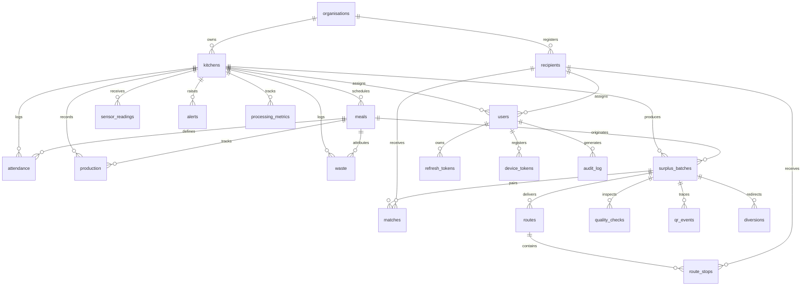

# Database & Cache Schema Architecture Document
**Target Service:** `food-waste-backend` (`newBKend`)  
**Database Engines:** PostgreSQL 16 (Relational/Analytical Core) & Redis 7 (In-Memory Telemetry, Cache, Streams & Locks)  
**Schema Version:** Migrations `0001` through `0009` + Redis DB 0 / DB 1 Specification

---

## 1. Executive Architecture Overview

The backend strictly conforms to a hybrid persistence architecture:
1. **PostgreSQL 16**: Acts as the single source of truth (SSOT) for domain entities, relational integrity, audit trails, and analytical aggregation views. All tables use UUIDv4/UUIDv7 primary keys (`gen_random_uuid()`) and UTC timestamps (`timestamptz`).
2. **Redis 7 (Dual Database Layout)**:
   - **DB 0**: Hot telemetry cache (`sensor:latest`), time-series stream (`stream:sensor`), sliding-window rate limiters, distributed locks (`SET NX PX`), idempotency payloads (24h TTL), danger-zone tracking, and SSE real-time pub/sub.
   - **DB 1**: Isolated background job and worker queue to prevent cache eviction interference.

```
+-----------------------------------------------------------------------------------+
|                                  PostgreSQL 16                                    |
|                                                                                   |
|  [0001 Core]         [0004 Telemetry]      [0005/0006 Quality/QR]  [0007/0008]    |
|  - organisations     - sensor_readings     - quality_checks        - audit_log    |
|  - kitchens          - alerts              - prediction_log        - diversions   |
|  - users                                   - outcome_feedback      - refresh_toks |
|  - recipients        [0006 Processing]     - qr_events (append)    - device_toks  |
|  - meals             - processing_metrics                          - offline ids  |
|  - attendance                                                                     |
|  - production        [0009 Materialized/Analytical Views]                         |
|  - waste             - v_training_set (ML demand forecast)                        |
|  - surplus_batches   - v_daily_waste (Aggregation by kitchen/cause)               |
|  - matches           - v_impact_summary (ESG & redistribution metrics)            |
|  - routes/stops                                                                   |
+-----------------------------------------------------------------------------------+
                                         ▲
                                         │ Asynchronous Persistence / Lookups
                                         ▼
+-----------------------------------------------------------------------------------+
|                                   Redis 7                                         |
|                                                                                   |
|  DB 0 (Cache & Streams)                     DB 1 (Queue & Worker Jobs)            |
|  - stream:sensor (IoT telemetry stream)     - async worker tasks                  |
|  - sensor:latest (Hash of latest metrics)   - offline sync ingestion queue        |
|  - analytics:impact:{id} (30s TTL cache)                                          |
|  - dz:{batch_id} (Danger-zone accumulator)                                        |
|  - idem:{user}:{key} (24h HTTP idempotency)                                       |
|  - dedupe:{user}:{event_id} (Sync dedupe)                                         |
|  - rl:{user}:{endpoint} (Sliding window)                                          |
|  - alerts:broadcast (Pub/Sub SSE channel)                                         |
+-----------------------------------------------------------------------------------+
```

---

## 2. PostgreSQL Schema Breakdown

### 2.1 Core Domain Tables (`0001_core_schema.up.sql`)

#### `organisations`
Multi-tenant organizational root entity.
* `id` (`uuid`, PK): Primary identifier.
* `name` (`text`, NOT NULL): Organization display name.
* `type` (`text`, NOT NULL, default `'OTHER'`): Organization category.
* `created_at`, `updated_at` (`timestamptz`).

#### `kitchens`
Production kitchens generating surplus and waste.
* `id` (`uuid`, PK): Primary identifier.
* `org_id` (`uuid`, FK $\rightarrow$ `organisations.id` ON DELETE SET NULL).
* `name` (`text`, NOT NULL): Kitchen name.
* `type` (`text`, NOT NULL): CHECK constraint $\in$ `('HOSTEL', 'CORPORATE', 'HOSPITAL', 'CATERER', 'PROCESSING')`.
* `latitude`, `longitude` (`double precision`): Geographic coordinates.
* `timezone` (`text`, default `'Asia/Kolkata'`).
* `created_at`, `updated_at` (`timestamptz`).

#### `users`
System actors and staff members.
* `id` (`uuid`, PK): Primary identifier.
* `org_id` (`uuid`): Scope identifier.
* `kitchen_id` (`uuid`, FK $\rightarrow$ `kitchens.id` ON DELETE SET NULL): Scoped kitchen for staff.
* `recipient_id` (`uuid`, FK $\rightarrow$ `recipients.id` ON DELETE SET NULL): Scoped NGO recipient.
* `name` (`text`), `email` (`text`, NOT NULL, UNIQUE index on `lower(email)`).
* `password_hash` (`text`, NOT NULL): bcrypt hashed credentials.
* `role` (`text`, NOT NULL): CHECK constraint $\in$ `('KITCHEN', 'NGO', 'LOGISTICS', 'ADMIN', 'SYSTEM')`.
* `is_active` (`boolean`, default `true`).
* `created_at`, `updated_at` (`timestamptz`).

#### `recipients`
Beneficiaries, NGOs, food banks, and secondary processing partners.
* `id` (`uuid`, PK): Primary identifier.
* `org_id` (`uuid`, FK $\rightarrow$ `organisations.id` ON DELETE SET NULL).
* `name` (`text`, NOT NULL).
* `type` (`text`, NOT NULL): CHECK constraint $\in$ `('NGO', 'FOOD_BANK', 'SHELTER', 'COMMUNITY_KITCHEN', 'BUYER', 'FEED_FARM', 'COMPOST')`.
* `capacity_kg` (`numeric(10,2)`, CHECK $\ge 0$).
* `latitude`, `longitude` (`double precision`, NOT NULL): Used for Haversine distance ranking.
* `pickup_window_start`, `pickup_window_end` (`time`, CHECK `end > start`).
* `accepts_categories` (`text[]`, default `ARRAY['cooked','packaged','raw']`).
* `active` (`boolean`, default `true`).

#### `meals`
Planned or served meal services.
* `id` (`uuid`, PK): Primary identifier.
* `kitchen_id` (`uuid`, FK $\rightarrow$ `kitchens.id` ON DELETE RESTRICT).
* `date` (`date`, NOT NULL).
* `meal_type` (`text`, NOT NULL): CHECK constraint $\in$ `('BREAKFAST', 'LUNCH', 'SNACK', 'DINNER')`.
* `menu` (`jsonb`, default `'[]'`).
* `name`, `description` (`text`).
* `UNIQUE (kitchen_id, date, meal_type)`.

#### `attendance`
Diner turnout tracking for demand forecasting.
* `id` (`uuid`, PK): Primary identifier.
* `meal_id` (`uuid`, FK $\rightarrow$ `meals.id` ON DELETE CASCADE).
* `kitchen_id` (`uuid`, FK $\rightarrow$ `kitchens.id` ON DELETE CASCADE).
* `meal_date` (`date`).
* `expected_diners`, `actual_diners`, `head_count` (`integer`, CHECK $\ge 0$).
* `UNIQUE (kitchen_id, meal_date)`.

#### `production`
Food quantity prepared and consumed per meal.
* `id` (`uuid`, PK).
* `meal_id` (`uuid`, FK $\rightarrow$ `meals.id` ON DELETE SET NULL).
* `kitchen_id` (`uuid`, FK $\rightarrow$ `kitchens.id` ON DELETE CASCADE).
* `production_date` (`date`).
* `prepared_qty`, `consumed_qty`, `quantity_kg` (`numeric(10,2)`).
* `unit` (`text`, default `'kg'`).
* `UNIQUE (kitchen_id, meal_id, production_date)`.

#### `waste`
Food loss and waste logs.
* `id` (`uuid`, PK).
* `meal_id` (`uuid`, FK $\rightarrow$ `meals.id` ON DELETE SET NULL).
* `kitchen_id` (`uuid`, FK $\rightarrow$ `kitchens.id` ON DELETE CASCADE).
* `food_type` (`text`).
* `quantity_kg` (`numeric(10,2)`, NOT NULL, CHECK $\ge 0$).
* `cause` (`text`, CHECK $\in$ `('OVERPRODUCTION', 'LOW_ATTENDANCE', 'SPOILAGE', 'EXPIRY', 'STORAGE_ISSUE', 'PREPARATION_ERROR', 'OTHER')`).
* `waste_type` (`text`).
* `note` (`text`).
* `recorded_at` (`timestamptz`).
* `client_event_id` (`text`, UNIQUE): Enforces idempotent offline client sync.

#### `surplus_batches`
Available edible surplus food packages.
* `id` (`uuid`, PK).
* `batch_code` (`text`, UNIQUE).
* `meal_id` (`uuid`, FK $\rightarrow$ `meals.id` ON DELETE SET NULL).
* `kitchen_id` (`uuid`, FK $\rightarrow$ `kitchens.id` ON DELETE SET NULL).
* `food_name` (`text`, NOT NULL), `food_category` (`text`, default `'cooked'`).
* `quantity_kg` (`numeric(10,2)`, CHECK $> 0$).
* `prepared_at`, `expiry_at` (`timestamptz`, CHECK `expiry_at > prepared_at`).
* `safety_status` (`text`, CHECK $\in$ `('PENDING', 'ELIGIBLE', 'HOLD', 'REJECTED')`).
* `status` (`text`, CHECK $\in$ `('PENDING_SAFETY', 'AVAILABLE', 'HOLD', 'DIVERTED', 'EXPIRED', 'MATCHED', 'IN_TRANSIT', 'DELIVERED')`).
* `approved_by` (`uuid`, FK $\rightarrow$ `users.id` ON DELETE SET NULL).
* `approved_at` (`timestamptz`).
* `client_event_id` (`text`, UNIQUE).

#### `matches`
Algorithmic pairings between surplus batches and recipient NGOs.
* `id` (`uuid`, PK).
* `batch_id` (`uuid`, FK $\rightarrow$ `surplus_batches.id` ON DELETE CASCADE).
* `recipient_id` (`uuid`, FK $\rightarrow$ `recipients.id` ON DELETE RESTRICT).
* `score` (`numeric(6,2)`, CHECK $\ge 0$).
* `score_breakdown` (`jsonb`), `reasons` (`text[]`).
* `status` (`text`, CHECK $\in$ `('OFFERED', 'ACCEPTED', 'DECLINED', 'EXPIRED')`).
* `offered_at`, `responded_at`, `expires_at` (`timestamptz`).
* `client_ts` (`timestamptz`).
* `UNIQUE (batch_id, recipient_id)`.

#### `routes` & `route_stops`
Optimized logistics distribution routing.
* `routes.id` (`uuid`, PK), `batch_id` (`uuid`, FK $\rightarrow$ `surplus_batches.id` ON DELETE CASCADE).
* `distance_km` (`numeric(10,2)`), `eta_minutes` (`integer`), `status` (`text`, default `'planned'`).
* `route_stops.id` (`uuid`, PK), `route_id` (`uuid`, FK $\rightarrow$ `routes.id` ON DELETE CASCADE).
* `recipient_id` (`uuid`, FK $\rightarrow$ `recipients.id` ON DELETE SET NULL).
* `sequence` (`integer`, NOT NULL), `UNIQUE (route_id, sequence)`.

---

### 2.2 Telemetry & Alerts (`0004_sensor_alerts.up.sql`)

#### `sensor_readings`
High-frequency environmental and energy telemetry.
* `id` (`bigserial`, PK).
* `sensor_id`, `device_id`, `location_id` (`text`).
* `kitchen_id` (`uuid`, FK $\rightarrow$ `kitchens.id` ON DELETE SET NULL).
* `batch_id` (`uuid`, FK $\rightarrow$ `surplus_batches.id` ON DELETE SET NULL).
* `ts`, `recorded_at` (`timestamptz`).
* `temperature_c` (`numeric(5,2)`, CHECK $-30 \le temp \le 120$).
* `humidity_pct` (`numeric(5,2)`, CHECK $0 \le humidity \le 100$).
* `energy_kwh` (`numeric(10,3)`, CHECK $\ge 0$).
* `value` (`numeric(10,3)`), `unit` (`text`).

#### `alerts`
Actionable notifications generated from telemetry excursions.
* `id` (`uuid`, PK).
* `kitchen_id` (`uuid`, FK $\rightarrow$ `kitchens.id` ON DELETE CASCADE).
* `alert_type` (`text`, CHECK $\in$ `('TEMP_EXCURSION', 'HUMIDITY_HIGH', 'ENERGY_SPIKE', 'DOWNTIME_HIGH', 'MATERIAL_LOSS_HIGH', 'EXPIRY_SOON', 'SENSOR_STALE')`).
* `severity` (`text`, CHECK $\in$ `('INFO', 'WARN', 'CRITICAL')`).
* `message` (`text`, NOT NULL), `payload` (`jsonb`).
* `is_acked` (`boolean`, default `false`).
* `acknowledged_by` / `acked_by` (`uuid`, FK $\rightarrow$ `users.id` ON DELETE SET NULL).
* `acknowledged_at` / `acked_at` (`timestamptz`).

---

### 2.3 Quality, Prediction & Feedback (`0005_quality_predictions.up.sql`)

#### `quality_checks`
Computer vision assessment and danger-zone exposure logs.
* `id` (`uuid`, PK).
* `batch_id` (`uuid`, FK $\rightarrow$ `surplus_batches.id` ON DELETE CASCADE).
* `image_path` (`text`).
* `visual_status` (`text`, CHECK $\in$ `('GOOD', 'RISK', 'REJECTED')`).
* `risk_level` (`text`, CHECK $\in$ `('LOW', 'MEDIUM', 'HIGH')`).
* `cv_confidence` (`numeric(5,4)`), `detections` (`jsonb`), `cv_model_version` (`text`).
* `safety_decision` (`text`, CHECK $\in$ `('ELIGIBLE', 'HOLD', 'REJECTED')`).
* `danger_zone_minutes` (`numeric(10,2)`, default `0`).
* `temperature_c` (`numeric(5,2)`).

#### `prediction_log`
Audit history of ML demand prediction invocations.
* `id` (`uuid`, PK).
* `kitchen_id` (`uuid`, FK $\rightarrow$ `kitchens.id` ON DELETE CASCADE).
* `meal_id` (`uuid`, FK $\rightarrow$ `meals.id` ON DELETE SET NULL).
* `request`, `response` (`jsonb`).
* `predicted_kg`, `actual_kg` (`numeric(10,2)`).
* `predicted_for` (`date`).

#### `outcome_feedback`
Closed-loop verification of actual meals consumed vs predicted.
* `id` (`uuid`, PK).
* `meal_id` (`uuid`, FK $\rightarrow$ `meals.id` ON DELETE SET NULL).
* `match_id` (`uuid`, FK $\rightarrow$ `matches.id` ON DELETE SET NULL).
* `recipient_id` (`uuid`, FK $\rightarrow$ `recipients.id` ON DELETE SET NULL).
* `predicted_p50`, `actual_consumed`, `prepared` (`numeric(10,2)`).
* `rating` (`integer`, CHECK $1 \le rating \le 5$).
* `UNIQUE (match_id, recipient_id)`.

---

### 2.4 QR Custody Chain & Processing Metrics (`0006_qr_hash_processing.up.sql`)

#### `qr_events` (Append-Only Cryptographic Chain)
* `id` (`uuid`, PK).
* `batch_id` (`uuid`, FK $\rightarrow$ `surplus_batches.id` ON DELETE CASCADE).
* `event_type` (`text`, CHECK $\in$ `('CREATED', 'APPROVED', 'MATCHED', 'PICKED_UP', 'HANDED_OFF', 'RECEIVED')`).
* `actor_id` (`uuid`), `actor_role` (`text`).
* `prev_hash` (`text`, NOT NULL), `event_hash` (`text`, NOT NULL).
* `server_ts` (`timestamptz`, NOT NULL), `client_event_id` (`text`, UNIQUE).
* **Immutability Enforcement:** PostgreSQL trigger `qr_events_immutable_trg` rejects all `UPDATE` and `DELETE` queries with an explicit restriction violation.

#### `processing_metrics`
KPIs for secondary kitchen production, batch cooking, and processing.
* `id` (`uuid`, PK).
* `kitchen_id` (`uuid`, FK $\rightarrow$ `kitchens.id` ON DELETE CASCADE).
* `period_start`, `period_end` (`date`), `date` (`date`).
* `raw_material_kg`, `output_kg`, `waste_kg` (`numeric(10,2)`).
* `downtime_min`, `runtime_min` (`numeric(10,2)`), `energy_kwh` (`numeric(10,3)`).
* `material_loss_pct`, `downtime_pct`, `efficiency_score` (`numeric(6,2)`).
* `UNIQUE (kitchen_id, period_start, period_end)`.

---

### 2.5 Audit & Recovery Hierarchy Diversion (`0007_audit_diversion.up.sql`)

#### `audit_log`
System-wide audit trail.
* `id` (`uuid`, PK).
* `user_id` / `actor_id` (`uuid`).
* `action` (`text`, NOT NULL).
* `entity` / `resource_type` (`text`), `entity_id` / `resource_id` (`text`).
* `before`, `after`, `metadata` (`jsonb`).
* `ip` (`text`).

#### `diversions`
Non-human edible recovery streams (EPA food recovery hierarchy).
* `id` (`uuid`, PK).
* `batch_id` (`uuid`, FK $\rightarrow$ `surplus_batches.id` ON DELETE CASCADE).
* `stream` (`text`, CHECK $\in$ `('ANIMAL_FEED', 'COMPOST', 'BIOGAS')`).
* `from_status`, `to_status` (`text`).
* `recipient_id` (`uuid`, FK $\rightarrow$ `recipients.id` ON DELETE SET NULL).
* `quantity_kg` (`numeric(10,2)`).

---

### 2.6 Mobile Clients & Offline Idempotency (`0008_mobile.up.sql`)

#### `refresh_tokens`
Cryptographic refresh token rotation families.
* `id` (`uuid`, PK).
* `user_id` (`uuid`, FK $\rightarrow$ `users.id` ON DELETE CASCADE).
* `family_id` (`uuid`, NOT NULL).
* `token_hash` (`text`, NOT NULL, UNIQUE): SHA-256 hash of raw token (raw token is never persisted).
* `is_revoked` (`boolean`, default `false`).
* `expires_at` (`timestamptz`, NOT NULL).

#### `device_tokens`
FCM push notification tokens.
* `id` (`uuid`, PK).
* `user_id` (`uuid`, FK $\rightarrow$ `users.id` ON DELETE CASCADE).
* `platform` (`text`, CHECK $\in$ `('ANDROID', 'IOS')`).
* `token` (`text`, NOT NULL, UNIQUE).
* `is_valid` (`boolean`, default `true`).

---

### 2.7 Analytical Views (`0009_views.up.sql`)

1. **`v_training_set`**:
   - Joins `meals`, `attendance`, `production`, `surplus_batches`, and `waste`.
   - Computes ISO day-of-week (`0 = Monday`), scheduled attendance, actual diners, prepared portions, surplus kg, and waste kg for ML model training.
2. **`v_daily_waste`**:
   - Aggregates daily waste by `kitchen_id`, `date`, and `cause` (`waste_kg`, `records`).
3. **`v_impact_summary`**:
   - Combines redistributed surplus batches (`status = 'DELIVERED'`) and diversions (`ANIMAL_FEED`, `COMPOST`, `BIOGAS`).
   - Yields `redistributed_kg`, `diverted_kg`, and net `waste_avoided_kg` per kitchen and date.

---

## 3. Redis Data Structures & Key Namespaces

| Key Pattern | Redis Type | DB | TTL | Usage / Description |
| :--- | :--- | :---: | :---: | :--- |
| `stream:sensor` | Stream | 0 | None (capped) | Time-series ingestion of raw IoT sensor payloads. |
| `sensor:latest` | Hash | 0 | None | Key: `{kitchen_id}:{sensor_id}`, Value: JSON snapshot of latest telemetry. |
| `analytics:impact:{kitchen_id}` | String (JSON) | 0 | 30s | Cached response of `/api/v1/analytics/impact` computed from `v_impact_summary`. |
| `dz:{batchID}` | Hash | 0 | None (manual) | Danger-zone accumulator. Field `minutes` updated via Lua script (capped at 15.0m). |
| `idem:{userID}:{key}` | String (JSON) | 0 | 24 Hours | HTTP idempotency cache storing status code and response body for deduplication. |
| `dedupe:{userID}:{clientEventID}` | String | 0 | 24 Hours | Offline synchronization deduplication token (`SET NX`). |
| `lock:{resource}:{id}` | String | 0 | 5s - 30s | Distributed mutex lock via `SET NX PX` released via atomic Lua script. |
| `rl:{key}` | Sorted Set | 0 | Window ms | Sliding-window rate limit buckets using request timestamps as ZSET scores. |
| `alerts:broadcast` | Pub/Sub | 0 | N/A | Broadcast channel distributing alerts to Server-Sent Events (SSE) subscribers. |
| `queue:jobs` | List / ZSet | 1 | N/A | Worker job queue (isolated from DB 0 cache evictions). |

---

## 4. Entity Relationship Diagram (ERD)


